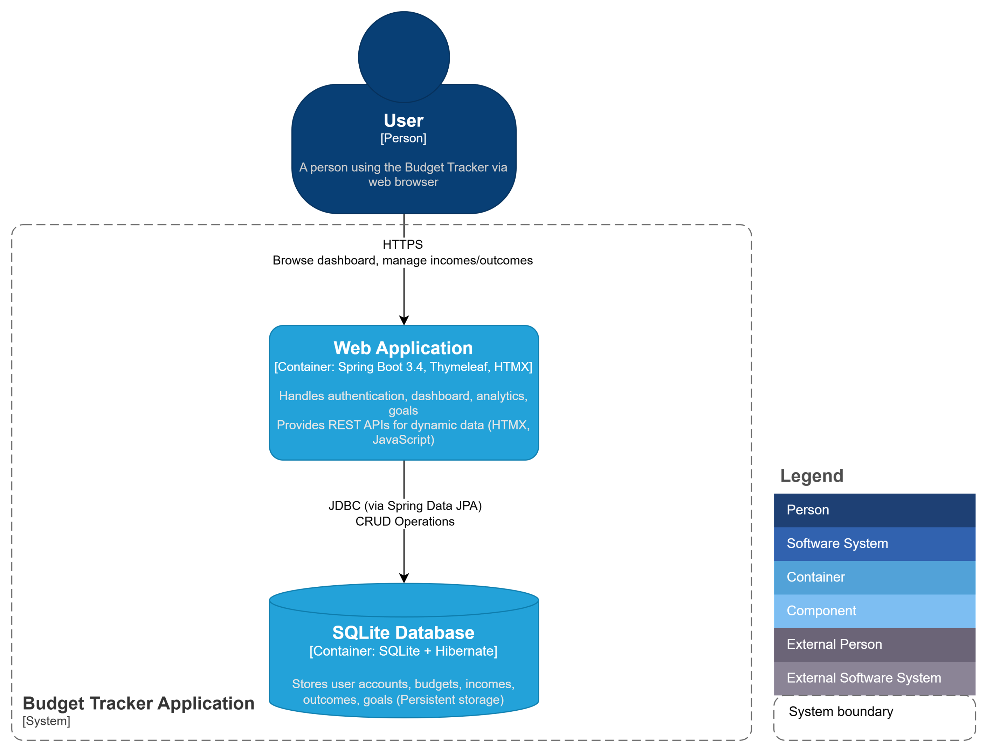

# Budget Tracker Web Application

## Introduction
A personal finance management web application to track incomes, outcomes (expenses), set budgets per category, and define financial goals (savings, debts, mortgages).
Built with Spring Boot, SQLite, Thymeleaf, HTMX, and Chart.js.

## Features
* User registration, login, and password reset.

* Income and outcome tracking by categories.

* Per-category budget limits and warning system (90% usage alerts).

* Financial goals (savings, debts, mortgage) tracking.

* Analytics dashboard with line charts, bar charts, and pie charts.

* Export incomes and outcomes to CSV format.

* Top 5 spending categories analysis.

## Technologies Used
* Backend: Java 21, Spring Boot 3.4 (MVC, JPA, Security)

* Frontend: Thymeleaf templates, HTMX (dynamic interaction), Chart.js (graphs)

* Database: SQLite with Hibernate (ORM)

* Authentication: Spring Security (custom user system)

* Build Tool: Maven

## Installation Instructions
1. Clone the Repository

```bash
git clone https://github.com/Katsiatyna/BudgetTracker.git
```
2. Install Requirements

* Java 21 installed.

* Maven installed (or use Maven Wrapper if provided).

* No need to install SQLite separately — it runs embedded.
  
3. Build the Project
   
  ```bash
  mvn clean install
  ```
4. Run the Application

  ```bash
  mvn spring-boot:run
  ```
The app will start on http://localhost:8082 by default.

 ## How to run
 
1. Open your web browser.

2. Visit http://localhost:8082/

3. Features available after login:

* Add incomes, outcomes, and budgets.

* View financial dashboards, charts, analytics.

* Track savings, debt, and mortgage goals.

## Architecture Diagram

The system architecture follows C4 modeling standards.


 
## Notes
* Default database location: db/budgettracker.db

* Passwords are securely hashed using BCrypt.

* Spring Security handles authentication and authorization.
